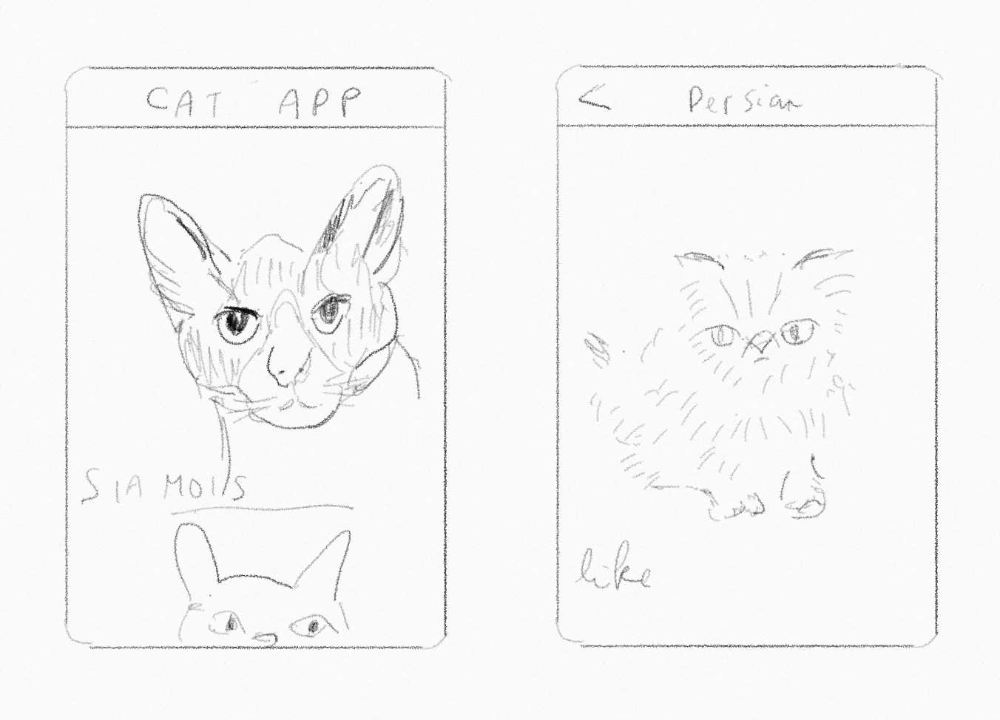
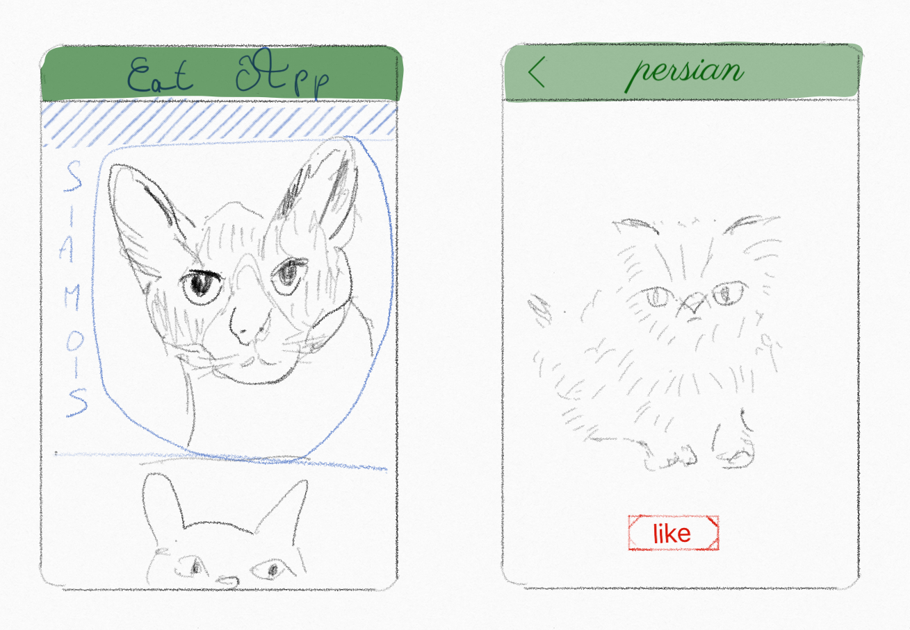
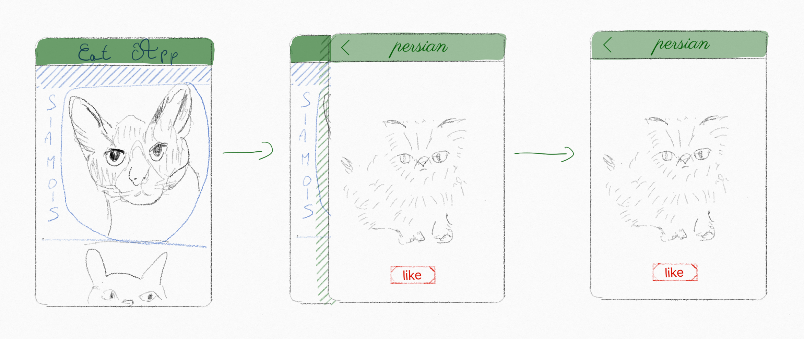

# Athlete

Athlete is a **native looking** app builder for elm !

`Elegant.elm` and `Bodybuilder.elm` are the underlying parts of Athlete.

They use the best parts of HTML and CSS under the hood to let you create stunning apps.

The key idea is to let you control the exact graphical path you want take, without compromises. We dreamt for years about creating this framework, but we finally did it.

A simple example being a lot better than tons of explanations, let's begin with an app we want to build with Athlete.

Let's create a cat browsing app (everybody knows that it's the next Facebook in terms of ROI).

## Athlete - build your app, **one function at a time ™**

Start with 2 bodybuilder views



Add some elegant styles (almost all the css spec is built in, in a type safe way)



Create your router : your views are now part of an app !

``` elm
type CatRouter
  = CatsIndex
  | CatShow Id
```

Use (or implement) transitions between your views !



**You are done !** You can know deploy your app on the app store and the android store (and even the web)

But there's more, far more... you can create so many other [things](https://elm-athlete.github.io/athlete) with Athlete.
